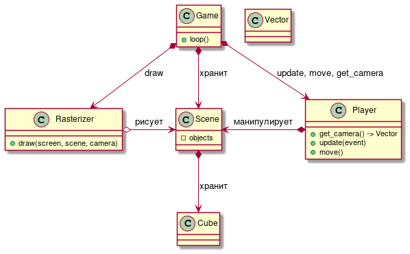

# Vfqyrhfan (трансл. Майнкрафт)
Игровой движок с ортогональной трёхмерной графикой на базе библиотеки pygame.

> вставить картинку

### Возможности:
- [x] Корректная отрисовка кубов
- [x] Перемещение и вращение персонажа от 1 лица
- [ ] Гравитация и прыжок
- [ ] Разрушение/постановка кубов

### Зависимости
- python
- pygame
- njit

### Внутренняя структура

